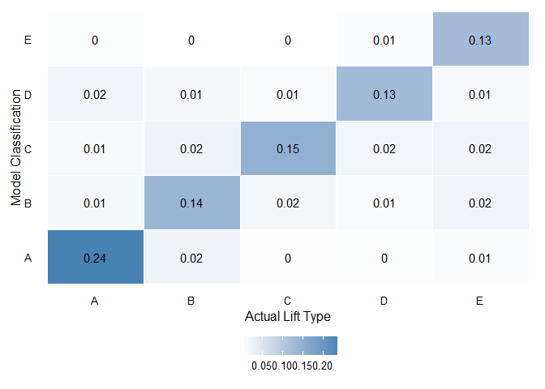
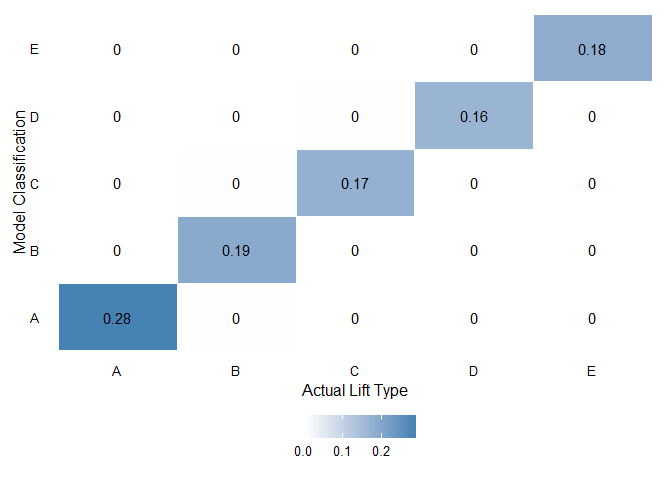
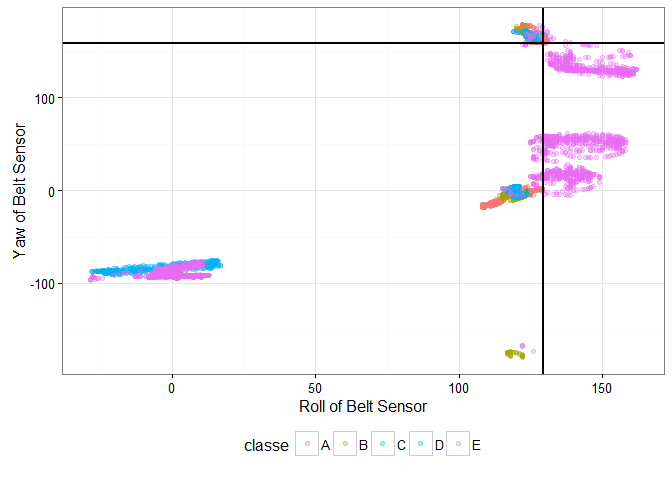

# Practical Machine Learning Course Project
Analysis Summary  


## Background
Using wearable technology, many people track measures of their activity, including fitness measures.  These technologies have been used to quantify the quantity of a particular activity; but, little has been done to quantify the quality of the activity.  A study was conducted in which six participants were asked to perform a set of 10 barbell lifts.  The participants were instructed on the proper form of the lifts and guided by a trainer.  During the lifts, sensors (gyroscope, accelerometer, magnetometer) within a mobile device recorded data.  The sensor was located on the subject's belt, arm, and forearm as well as the dumbbell itself.  Each of the six participants were also instructed on four incorrect ways of performing the barbell lifts corresponding to common mistakes.  Each participant performed a set of 10 barbell lifts in each of these four incorrect manners; again, they were guided by a trainer and data was recorded using the sensors.

The goal of the study was to use the metrics obtained from the sensors to correctly classify whether a subject's movements corresponded to the correct form or one of the four incorrect forms.  Further, if the subject is performing the lift incorrectly, it is important to classify which of the four methods is being utilized in order to achieve their secondary research objective.  In addition to classifying the method in which the lift is performed, researchers would like to eventually provide feedback to the user on how to correct their movements to correspond to a proper lift.

For our purposes, we construct a model to classify the type of lift being conducted by the subject using the metrics obtained from the sensors.  In addition, we want to classify 20 observations corresponding to subjects for which the type of lift is uknown.

The data was provided by the instructors and was made available by Groupware@LES.  The original data, along with a full description of the study and resulting publications can be found at [http://groupware.les.inf.puc-rio.br/har](http://groupware.les.inf.puc-rio.br/har) under the _Weight Lifting Exercises Dataset_ section.


## Model Construction
This section outlines the model construction.

### Training Set Construction
We were provided with two datasets.  The first dataset contained 20 records for which the class (type of lift being performed) was unknown.  It was of interest to classify each of these 20 records.  We refer to this as the prediction dataset.  The second dataset contained 19622 observations for which the class was known.  This larger dataset was split into a training and test dataset.  The training dataset was used for model building and exploratory analysis.  The test dataset was used only to assess the final model's performance.

The training set was constructed by taking a stratified random sample of records for which the class was known.  The data was stratified by both username and class.  This ensured that roughly an equal proportion of records from each subject and lift-type combination were included in the training set.  The final training set consisted of 13751 observations and the test set 5871 observations (or a 70-30 split).  This is illustrated using the following code block:


```r
createDataPartition(interaction(pmltrain$classe,
                                pmltrain$user_name),
                    p=0.7)
```


### Feature Extraction
Many of the features (predictor variables) listed in the dataset were unavailable (missing) on all subjects.  Both username and the timestamp of when the data was observed were excluded from analysis.  We expect the combination of these variables to be completely confounded with the type of lift being conducted as it makes sense that lifts of the same type were conducted together.  However, these features would not be useful for prediction on new users at future time points and were therefore removed from consideration.  Only data available from the sensors were used in our prediction model.

Three sensors (gyroscope, accelerometer and magnetometer) were located in each of four locations (belt, arm, forearm and dumbbell) giving a total of twelve sensors.  Each sensor provided three component metrics (essentialy movement along the x-, y- and z- axes).  These component metrics were combined (by the company providing the data) into summary information characterizing the roll, pitch, and yaw (describing the movement through space) as well as the total acceleration of the sensors in each location.  Only these summary information was utilized in our prediction model giving a total of 16 predictors (4 characteristics in each of 4 locations).  The rationale for including only the summary measures was interpretability of any final model constructed.  Recall that the secondary objective of the company was to provide feedback to the user on what changes to make in order to correct an incorrect action.  In order to provide useful information, we would want more than "do the lift differently" and less than "the movement along the x-axis should be adjusted by q units."  However, a user might reasonably understand, "adjust the pitch of your forearm."


### Model Fit
Two models were fit, each emphasizing a different aspect of the study objectives.  A classification tree (CART model of Breiman _et. al_) was fit due to its ease of interpretation.  We felt the model could easily be used to provide feedback to a user about changes that could be made in order to perform the lift correctly.  However, a drawback of the CART model is its reduced classification accuracy; we estimated only 70% accuracy in the training set, which is an optimistic estimate.  Therefore, we also considered a boosted CART model using gradient boosting.  Boosting is known to improve prediction accuracy, but it suffers from producing models which are difficult to interpret as they are an ensemble of different classification trees.  Both models were fit using the `caret` package (version 6.0.70) in `R` (version 3.3.1).  The CART model was produced using the `method="rpart"` option and the boosted CART model using the `method="gbm"` option in the `train` function of the `caret` package.

Both models are robust to transformations of the feature variables.  Therefore, no pre-processing of the feature variables was performed.  All 16 of the feature variables described in the previous section were allowed to enter each of the two models.

The complexity of the tree produced by the CART model depends upon the "complexity parameter" which governs the information gain required by an additional node (decision point) to be included in the model.  The final boosted CART model is governed by the number of trees to include in the ensemble, the interaction depth (degree to which the effect of each feature is allowed to depend on other features), the shrinkage term (penalty to protect against overfitting) and the number of minimum observations in a node.  These tuning parameters were chosen using 10-fold cross-validation (a single replication) with accuracy as the metric for optimization.  Due to the large number of observations in the training set, this seemed a reasonable number of folds.  A grid search was used to choose the potential values of the tuning parameter.  For the CART model 25 potential choices were examined.  This proved computationally intensive for the boosted algorithm; therefore, only 10 potential tuning parameter combinations were examined.  This is illustrated in the following code block:


```r
train(classe ~ ., data=Training.Data, method="gbm",
      trControl=trainControl(method="cv", number=10),
      tuneLength=10)
```

From the cross-validation, the complexition parameter for the CART model was chosen as 0.00376.  For the boosted CART model, cross-validation suggested using 500 trees, with an interaction depth of 10, a shrinkage of 0.1, and a minimum of 10 observations in a node.


## Model Assessment and Prediction


The final models were assessed within the test set which had been held aside solely for the purpose of assessment.  Holding out a large subset of the original data (30%) allows us to construct an unbiased estimate of the accuracy (probability of correctly classifying a subject) of the models. Figures 1 and 2 compare the predictions of the CART model and boosted CART model, respectively, to the actual classifications within the test set.  The accuracy of the CART model is 77.1%; the accuracy of the boosted model is significantly better at 99.2%.





The benefit of the CART model is again found in the ease of interpretation.  For example, the first decision point is made using the roll (rotation about the front-to-back axis) of the belt.  If this measurement is above 129.5 and the yaw (rotation about the vertical axis) of the belt is below 158.5, then the subject is most likely performing an incorrect lift (lift type E).  However, if the roll of the belt is above 129.5 and the yaw of the belt is above 158.5, then the subject is most likely performing a correct lift (lift type A).  Figure 3 illustrates this clearly.  Observations for which the roll on the belt exceeded 129.5 correspond primarily to lifts of type A and E; a further breakdown is made by examining the yaw of the belt.  So, subjects with a large roll value but a lower yaw value from the belt could adjust the yaw in order to move into a correct form of the lift.


